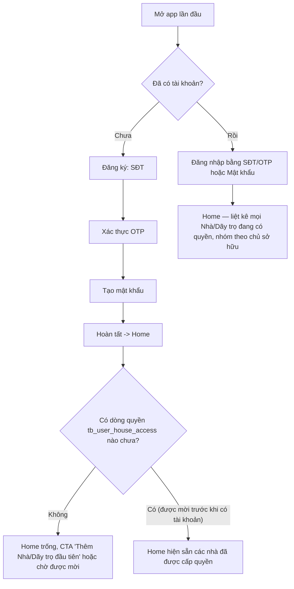
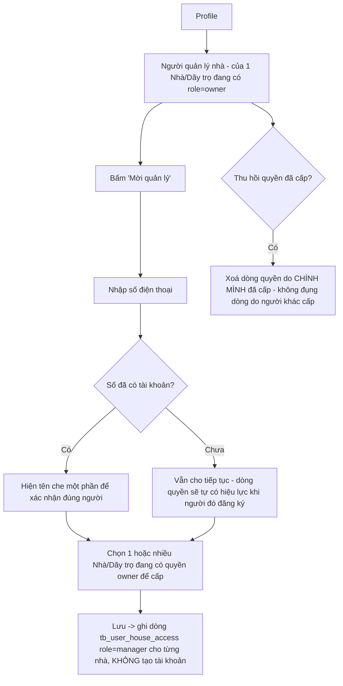
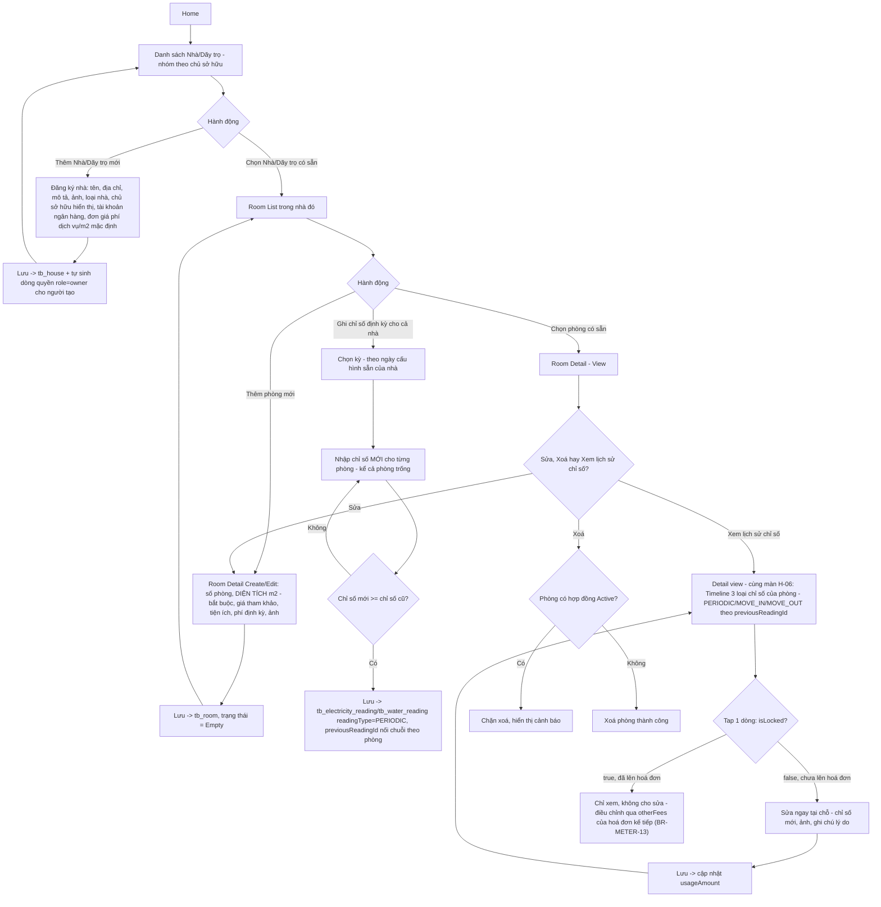
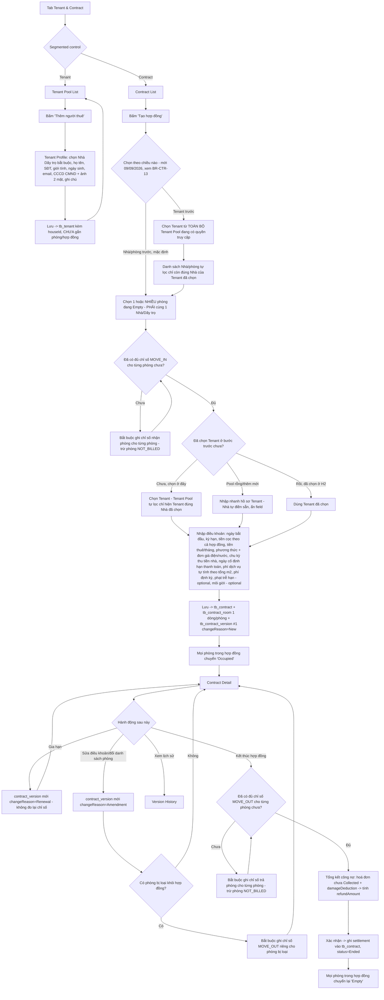
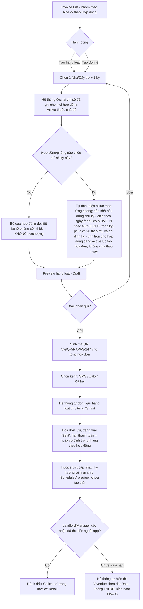
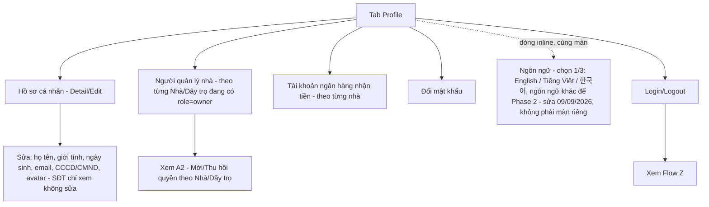
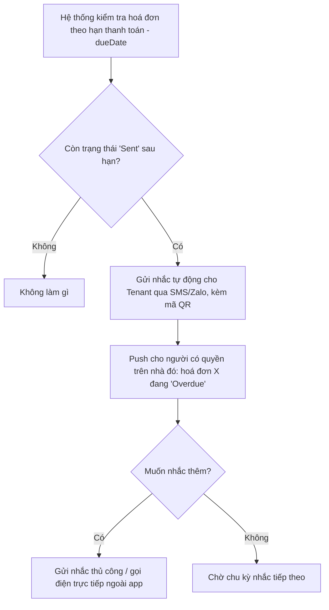
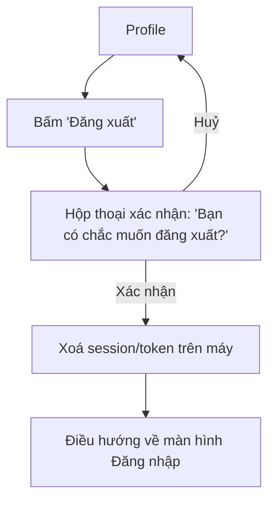

# User Flows — BizTown Rent-Manager
> **Trạng thái tài liệu:** Version 3 **Last updated:** 2026-09-08
> Diagram dùng cú pháp **Mermaid** — hiển thị trực tiếp trên GitHub.
> **Thay đổi lớn:** Cấu trúc app đổi từ **5 menu → 4 tab** (Home, Tenant & Contract, Bills, Profile — xem [SCREEN-SPEC.md](SCREEN-SPEC.md) mục 1). Gộp luồng Đăng ký/Đăng nhập của Landlord và Manager thành **1 luồng duy nhất**; bỏ hẳn luồng "Landlord tạo tài khoản Manager", thay bằng **Mời quản lý bằng số điện thoại** (chỉ ghi quyền, không tạo tài khoản). Thêm flow **Ghi chỉ số điện/nước** (3 loại). Cập nhật flow Hợp đồng cho **nhiều phòng/hợp đồng** + chặn bằng chỉ số nhận phòng. Cập nhật flow Hoá đơn cho **tạo hàng loạt + mã QR**. Xem [DECISIONS.md](DECISIONS.md) 2026-09-08.

---

## 0. Danh sách flow trong file này

### 4 Core Flows (theo [PRODUCT-OVERVIEW](PRODUCT-OVERVIEW.md) mục 5.1 — mỗi flow tương ứng 1 tab)

1. Home — Quản lý Nhà/Dãy trọ, Phòng & Ghi chỉ số điện/nước
2. Tenant & Contract — Quản lý Người thuê (Tenant Pool) + Hợp đồng (nhiều phòng, Version History)
3. Bills (core) — Tạo hàng loạt & gửi hoá đơn tự động (kèm mã QR), theo dõi thu tiền
4. Profile — Hồ sơ cá nhân, quản lý quyền truy cập theo Nhà/Dãy trọ, đăng nhập/đăng xuất

### Flow hỗ trợ (Supporting)

- **A1.** Đăng ký/Đăng nhập — dùng chung cho mọi người (không còn phân biệt vai trò lúc đăng ký)
- **A2.** Mời quản lý bằng số điện thoại (ghi quyền theo từng Nhà/Dãy trọ, không tạo tài khoản)
- **C.** Nhắc thanh toán quá hạn (hỗ trợ Flow #3)
- **Z.** Đăng xuất (Logout)

> ~~Flow #3 House/Room Search, Flow B (Tenant xem & thanh toán trong app), Flow #8 Service Request Management~~ → **Ngoài phạm vi Phase 1** — xem [PRODUCT-OVERVIEW](PRODUCT-OVERVIEW.md) mục 5.2.

---

## A1. Đăng ký/Đăng nhập — dùng chung cho mọi người

Không còn bước chọn vai trò hay màn đăng ký riêng cho quản lý — **mọi người dùng cùng 1 luồng đăng ký/đăng nhập**. Vai trò (owner/manager) chỉ xuất hiện khi vào từng Nhà/Dãy trọ cụ thể (xem [BUSINESS-RULES](BUSINESS-RULES.md) BR-ROLE-01).

---

## A2. Mời quản lý bằng số điện thoại (Profile)

Không có Edge Function tạo tài khoản, không có Supabase Admin API — khác biệt lớn nhất so với Version 2 ("Landlord tạo tài khoản Manager"). Một số điện thoại có thể được nhiều chủ nhà khác nhau mời làm quản lý cho nhà của họ, độc lập hoàn toàn với nhau (xem [BUSINESS-RULES](BUSINESS-RULES.md) BR-DATA-04).

---

## 1. Home — Nhà/Dãy trọ, Phòng & Ghi chỉ số điện/nước — CORE FLOW

1 phòng = 1 công tơ, không đăng ký/quản lý công tơ riêng. Ghi chỉ số định kỳ áp dụng cho MỌI phòng của nhà kể cả phòng trống, vào 1 ngày cố định/tháng — hệ thống nhắc trước 1 ngày (BR-NOTI-05). Không áp dụng cho phòng/hợp đồng cấu hình `NOT_BILLED` (VD căn hộ nguyên căn). Chỉ số lúc nhận/trả phòng (`MOVE_IN`/`MOVE_OUT`) được ghi trực tiếp trong Flow #2 (Tenant & Contract), không phải ở đây — xem BR-READ-06 về lý do đặt 2 loại này thành bước chặn trong flow hợp đồng.

> **Cập nhật 09/08 (sửa trực tiếp trong FigJam):** entry (K/L/N), detail view (P) và edit tại chỗ (P2) nay dồn về **1 màn duy nhất — H-06 Record Monthly Reading (PERIODIC)** trong [SCREEN-SPEC.md](SCREEN-SPEC.md), thay vì 3 màn tách rời Reading Entry/History/Correction ở bản trước. Sửa chỉ số chỉ khả dụng ngay trong detail view khi `isLocked=false`; khi đã khoá thì không có đường sửa trực tiếp nào — mọi điều chỉnh đi qua dòng `otherFees` của hoá đơn kế tiếp (BR-METER-13).

---

## 2. Tenant & Contract — CORE FLOW

1 phòng chỉ 1 hợp đồng Active tại 1 thời điểm (ràng buộc UNIQUE trên `tb_contract_room`); 1 hợp đồng có thể gồm NHIỀU phòng nhưng chỉ 1 Tenant đại diện. Hoá đơn sẽ tách điện/nước theo từng phòng nhưng gộp 1 dòng tiền nhà/phí dịch vụ cho cả hợp đồng (xem Flow #3).

---

## 3. Bills — CORE FLOW (chức năng quan trọng nhất Phase 1)

Không còn bước Tenant tự đánh dấu "đã chuyển khoản". Điện/nước luôn tính theo tháng; tiền nhà chỉ xuất hiện đúng chu kỳ cấu hình trên hợp đồng (VD 2 tháng/lần) — kỳ không thu tiền nhà thì hoá đơn chỉ có điện/nước + phí dịch vụ + phí khác. **Cập nhật 09/09/2026 (`BR-BILL-08`):** khi đổi khách giữa tháng, chỉ **tiền nhà** chia theo số ngày ở; **phí dịch vụ và phí định kỳ không chia** — tính trọn cho hợp đồng đang có người ở tại thời điểm tạo hoá đơn của kỳ đó, phòng còn trống lúc đó thì không tính khoản này cho ai (chủ nhà tự chịu).

---

## 4. Profile — CORE FLOW

---

## C. Nhắc thanh toán quá hạn (Supporting — hỗ trợ Flow #3)

Tần suất nhắc: 3 ngày trước hạn, 1 ngày trước hạn, đúng hạn, 1 ngày sau hạn, 3 ngày sau hạn — xem BR-PAY-04.

---

## Z. Đăng xuất (Logout) — Supporting

