# User Flows — BizTown Rent-Manager
> **Trạng thái tài liệu:** Version 1  **Last updated:** 2026-08-28
> Diagram dùng cú pháp **Mermaid** — hiển thị trực tiếp trên GitHub.

---

## 0. Danh sách flow trong file này

### 8 Core Flows (theo [PRODUCT-OVERVIEW](PRODUCT-OVERVIEW.md) mục 5.1, bản cập nhật 2026-08-28 — đây là các flow xương sống của MVP, cần polish kỹ nhất, thứ tự 1→8 cũng là thứ tự ưu tiên UX)

1. House/Room Registration — Đăng ký Nhà/Dãy trọ & Phòng
2. Tenant Registration — Đăng ký Người thuê
3. House/Room Search — Tìm kiếm & xem nhà/phòng cho thuê 
4. Lease Contract Creation — Tạo Hợp đồng thuê
5. Periodic Meter Reading — Ghi chỉ số điện/nước định kỳ
6. Create Bills & Send via SMS/Zalo — Tạo hoá đơn & gửi tự động
7. Revenue Report — Báo cáo doanh thu
8. Service Request Management — Tạo & xử lý yêu cầu của người thuê (sửa chữa/bảo trì/đăng ký lưu trú...)

### Flow hỗ trợ (Supporting — cần thiết để có hành trình đầy đủ login→logout, không phải trọng tâm polish nhưng vẫn phải có trong Figma)

- **A1.** Đăng nhập/Đăng ký — Chủ trọ (Landlord)
- **A2.** Đăng nhập/Đăng ký — Người thuê (Tenant), qua lời mời
- **B.** Người thuê xem hoá đơn & thanh toán *(là "mặt sau" của Flow #6)*
- **C.** Nhắc thanh toán quá hạn *(hỗ trợ Flow #6)*
- **Z.** Đăng xuất (Logout)

---

## A1. Đăng nhập/Đăng ký — Chủ trọ (Landlord)

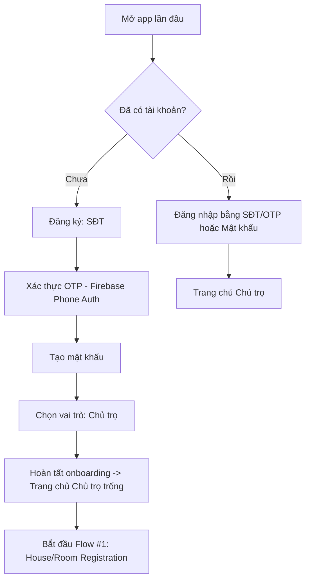
Chủ trọ không bắt buộc phải đăng ký phòng ngay khi đăng ký tài khoả, tách biệt 2 flow riêng biệt
---

## A2. Đăng nhập/Đăng ký — Người thuê (Tenant), qua lời mời

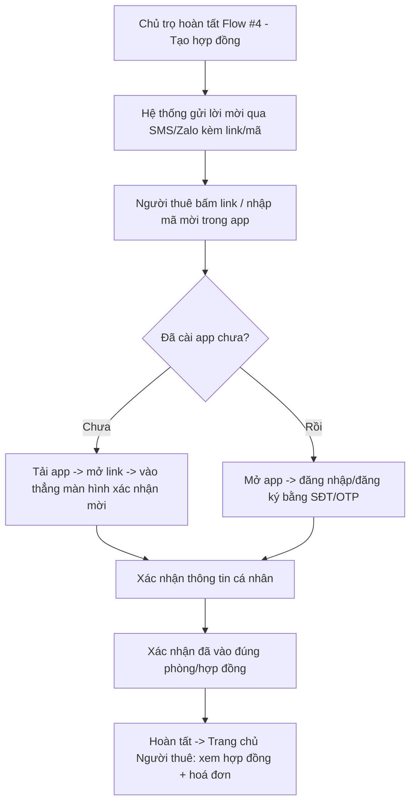
Người thuê should cài đặt app
Nội dung mẫu tin nhắn mời :
"Hi! 👋
I just created a lease agreement for your room on Town Rental app. Please check out this link to view the details and confirm:
[Link/Code]
Everything will be easier through the app - payments, receipts, maintenance requests... all in one place.
Let me know if you need any help! 😊"

---

## 1. House/Room Registration (Chủ trọ) — CORE FLOW

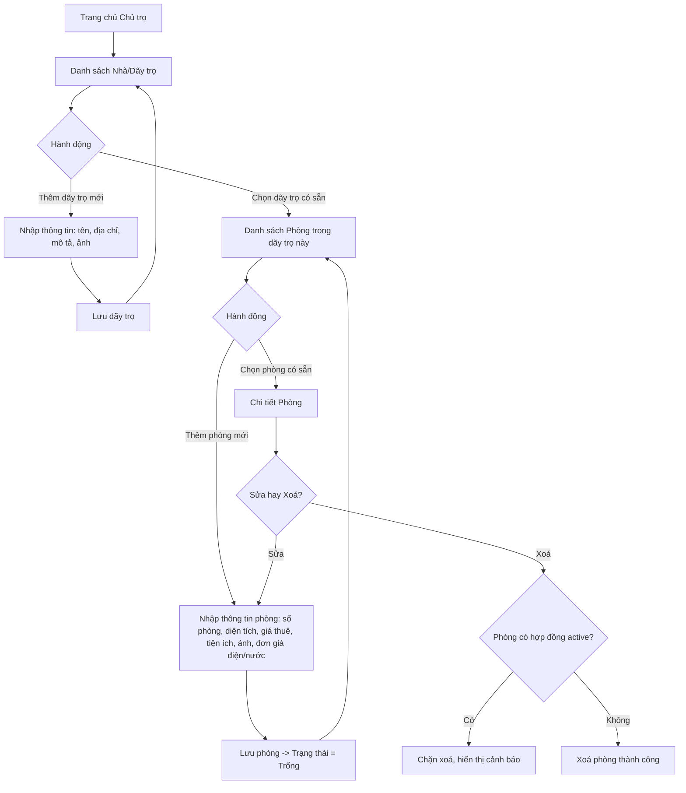
phase 1 không giới hạn số lượng phòng đăng ký
trong cùng 1 dãy trọ thì check trùng > cảnh báo

---

## 2. Tenant Registration (Chủ trọ) — CORE FLOW

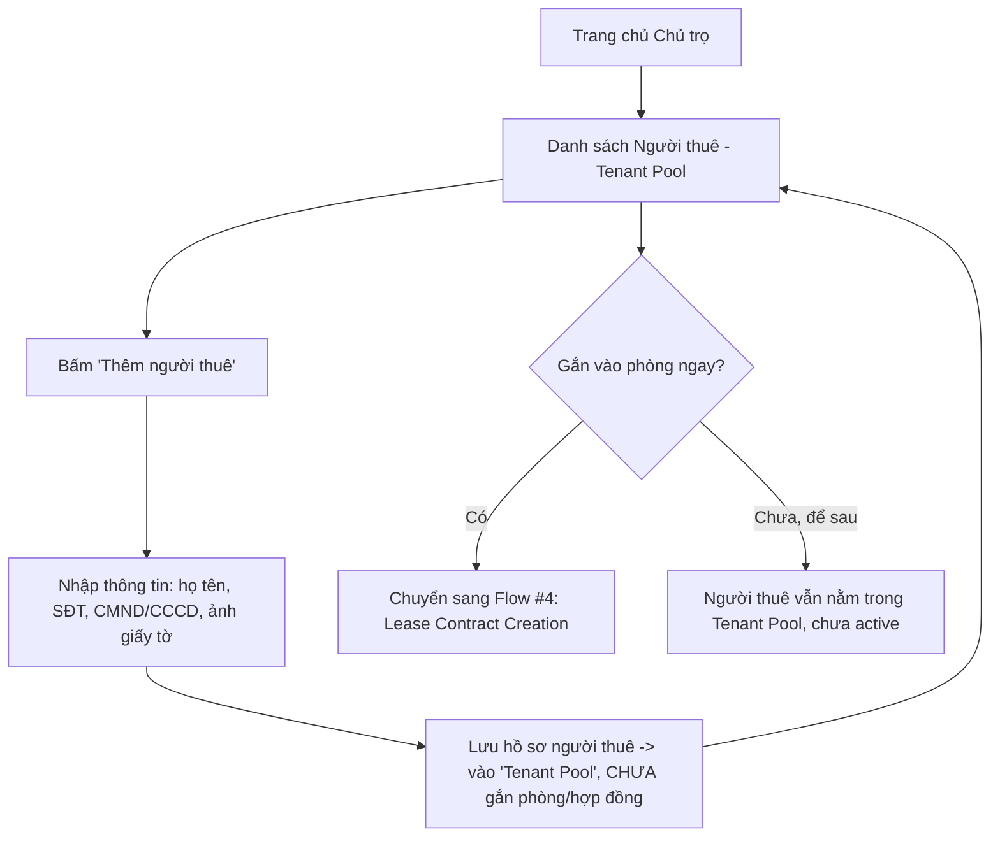
Chỉ mời người thuê dùng app khi số điện thoại chưa có tài khoản và đã ký hợp đồng

---

## 3. House/Room Search — Tìm kiếm & xem nhà/phòng cho thuê — CORE FLOW
### 3a. Người thuê (Tenant) — Tìm kiếm & gửi yêu cầu liên hệ

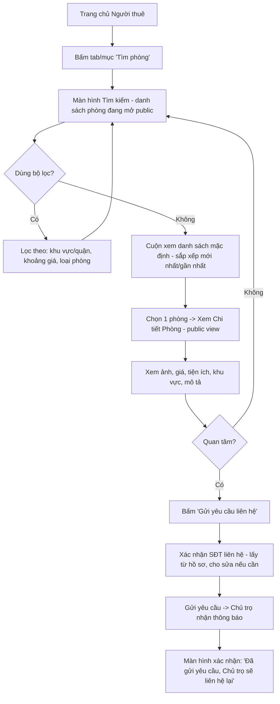
Người thuê đã có hợp đồng active ở nơi khác có được dùng tính năng tìm phòng

### 3b. Chủ trọ — Quản lý hiển thị Public Listing & Yêu cầu liên hệ

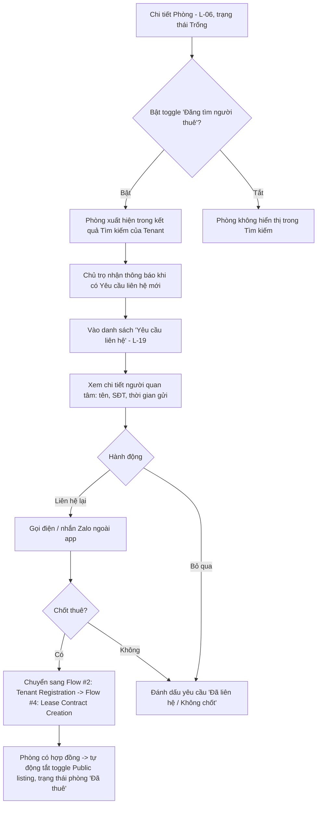

Phase 1 không giới hạn số phòng được đăng public 
Yêu cầu liên hệ tự xóa khi phòng không còn trống
---

## 4. Lease Contract Creation (Chủ trọ) — CORE FLOW

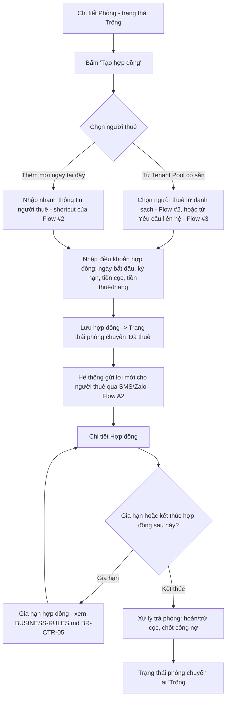

---

## 5. Periodic Meter Reading — Ghi chỉ số điện/nước định kỳ (Chủ trọ) — CORE FLOW

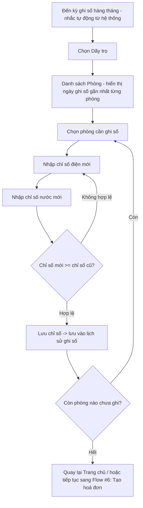
Hệ thống should nhắc ngày ghi chỉ số, theo lịch cố định mà landlord setting

---

## 6. Create Bills & Send via SMS/Zalo — Tạo hoá đơn & gửi tự động (Chủ trọ) — CORE FLOW

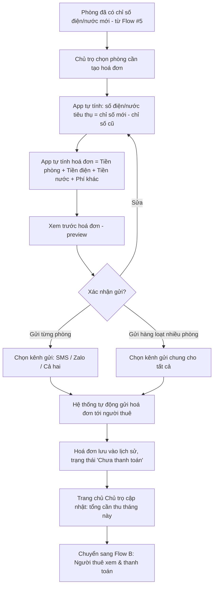
"Phí khác" bao gồm nhiều loại được tính theo điều khoản hợp đồng, được landlord nhập vào hệ hợp đồng thuê
đơn gia theo nội dung hợp đồng, được landlord điền hoặc tự động hiển thị theo hợp đồng

---

## 7. Revenue Report — Báo cáo doanh thu (Chủ trọ) — CORE FLOW

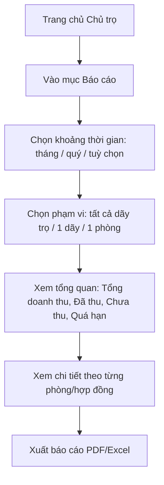
---

## 8. Service Request Management — Yêu cầu của Người thuê — CORE FLOW

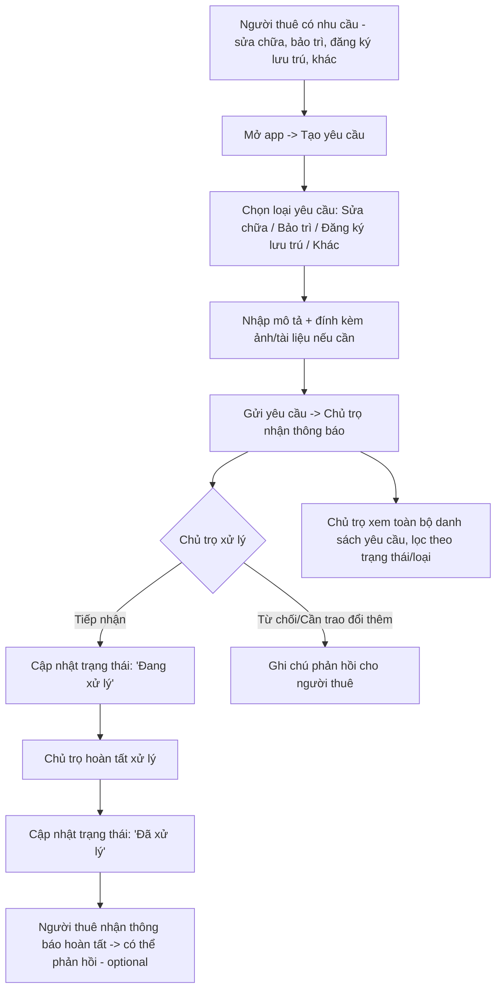
"loại yêu cầu khác" bao gồm Sửa chữa/Bảo trì/Đăng ký lưu trú/Khác. Chọn "Khác" sẽ có input để nhập
nếu phát sinh chi phí thì landlord phản hồi trong ghi chú và giải quyết thủ công không qua app

---

## B. Người thuê xem hoá đơn & thanh toán (Supporting — "mặt sau" của Flow #6)

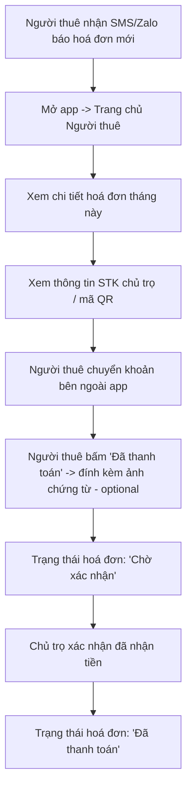
---

## C. Nhắc thanh toán quá hạn (Supporting — hỗ trợ Flow #6)

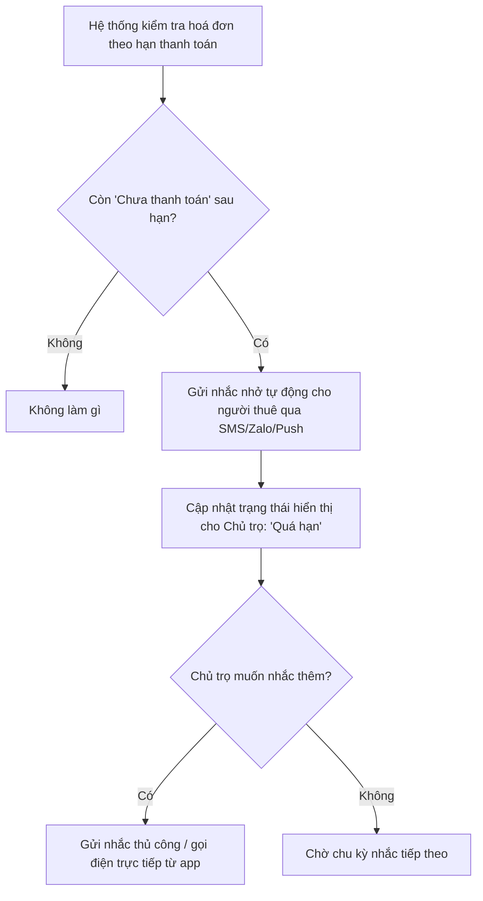
tần suất nhắc: 3 ngày trước hạn, 1 ngày trước hạn, đúng hạn, 1 ngày sau hạn, 3 ngày sau hạn

---

## Z. Đăng xuất (Logout) — Supporting, cả 2 vai trò

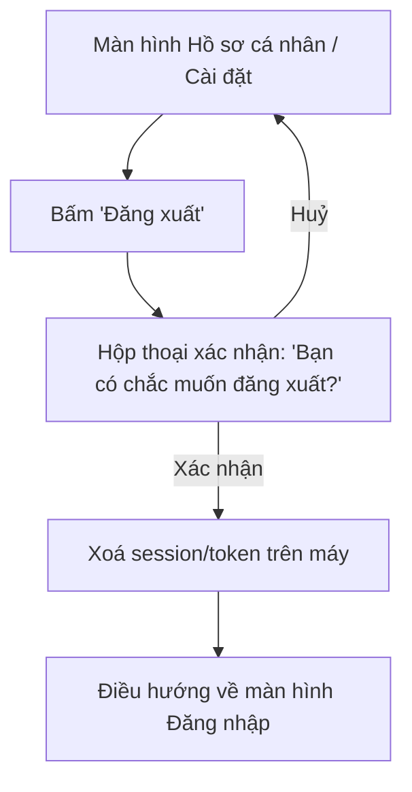

