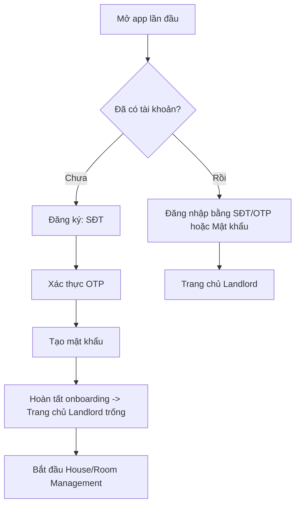
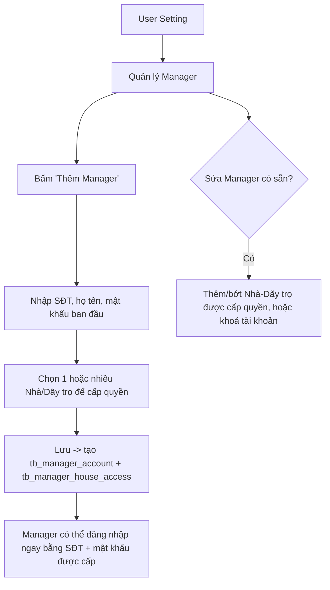
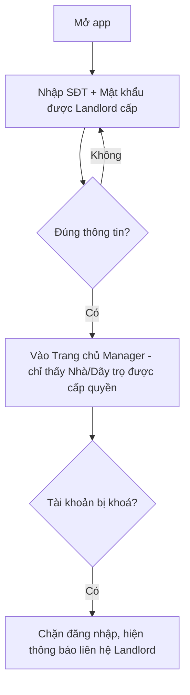
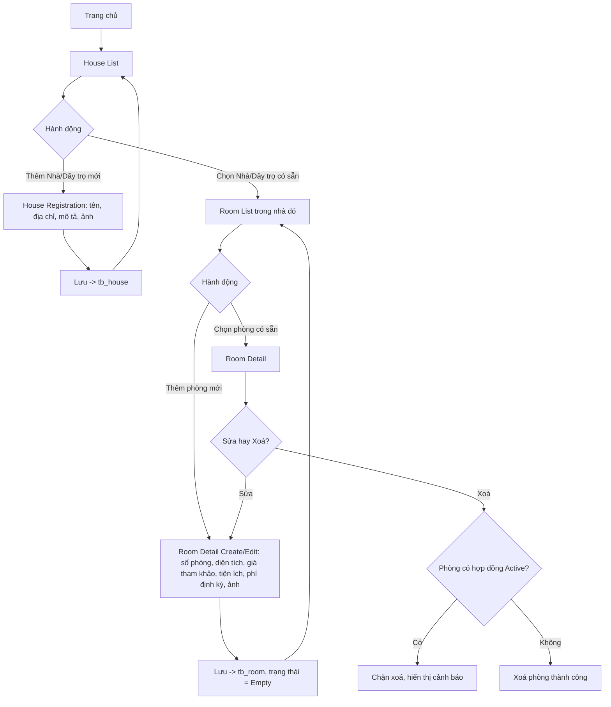
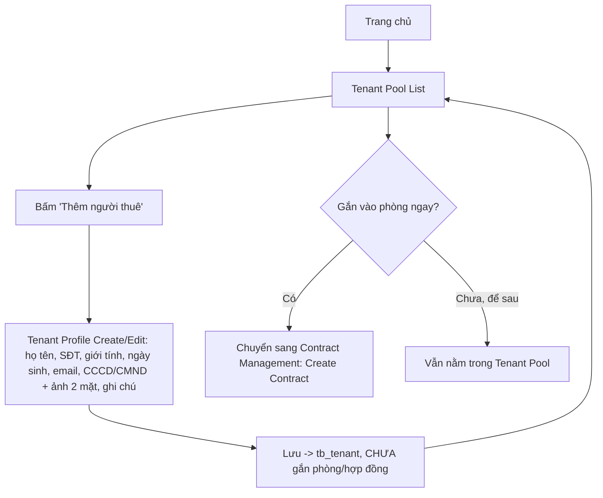
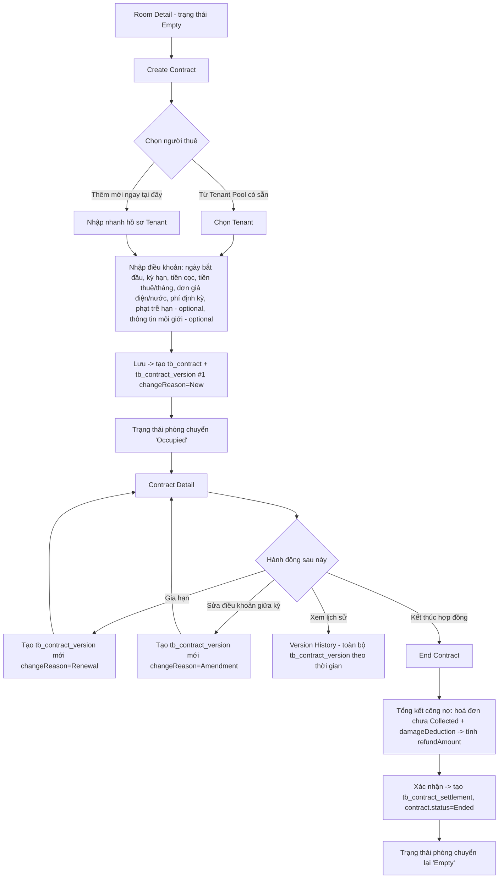
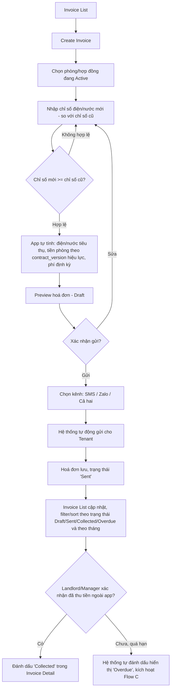
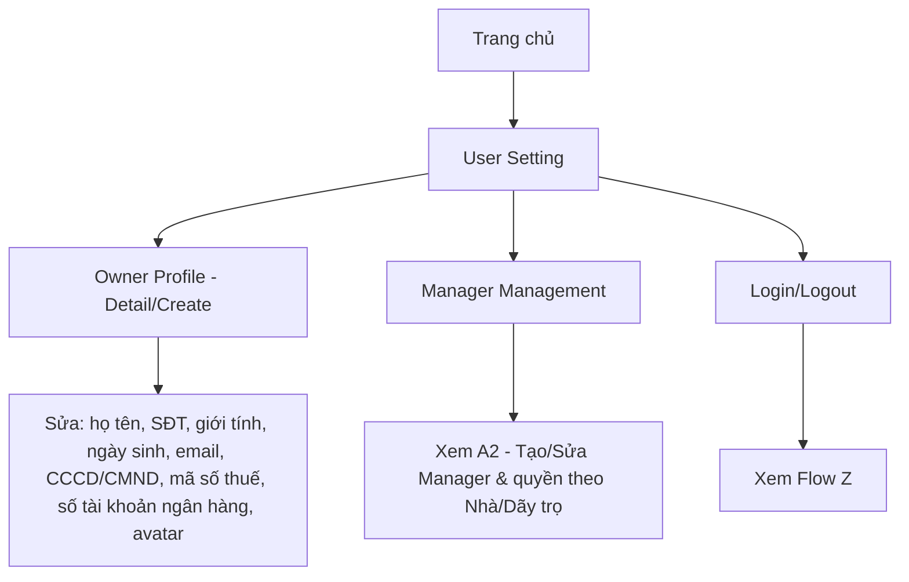
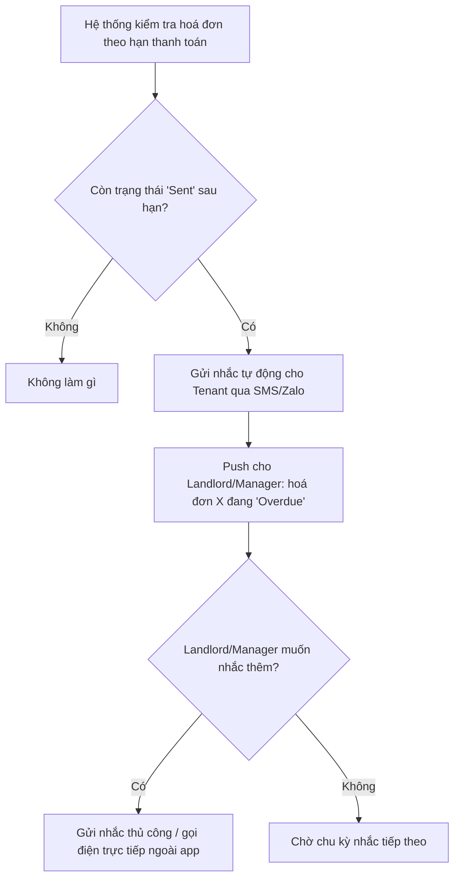
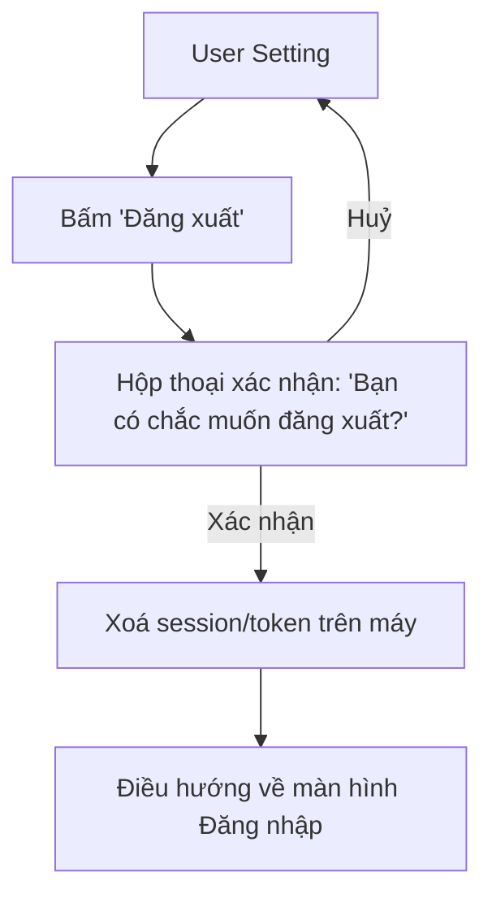

# User Flows — BizTown Rent-Manager
> **Trạng thái tài liệu:** Version 2 **Last updated:** 2026-09-03
> Diagram dùng cú pháp **Mermaid** — hiển thị trực tiếp trên GitHub.
> **Thay đổi lớn:** Viết lại toàn bộ theo cấu trúc **5 menu chính** cho Landlord + Manager (bỏ app Tenant). Bỏ Flow Search (#3 cũ), Flow Service Request (#8 cũ), Flow B (Tenant xem & thanh toán trong app). Thêm flow Manager onboarding, Contract Versioning, End Contract/Settlement. Xem [DECISIONS.md](DECISIONS.md) 2026-09-03.

---

## 0. Danh sách flow trong file này

### 5 Core Flows (theo [PRODUCT-OVERVIEW](PRODUCT-OVERVIEW.md) mục 5.1 — mỗi flow tương ứng 1 menu bottom-nav)

1. House/Room Management — Quản lý Nhà/Dãy trọ & Phòng
2. Tenant Management — Quản lý Người thuê (Tenant Pool)
3. Contract Management — Tạo/Xem/Gia hạn/Kết thúc Hợp đồng (kèm Version History)
4. Bill Management (core) — Tạo & gửi hoá đơn tự động, theo dõi thu tiền
5. User Setting — Hồ sơ Chủ nhà, quản lý tài khoản Manager, đăng nhập/đăng xuất

### Flow hỗ trợ (Supporting)

- **A1.** Đăng nhập/Đăng ký — Landlord
- **A2.** Landlord tạo tài khoản Manager & cấp quyền theo Nhà/Dãy trọ
- **A3.** Đăng nhập — Manager
- **C.** Nhắc thanh toán quá hạn (hỗ trợ Flow #4)
- **Z.** Đăng xuất (Logout)

> ~~Flow #3 House/Room Search, Flow B (Tenant xem & thanh toán trong app), Flow #8 Service Request Management~~ → **Ngoài phạm vi Phase 1** (yêu cầu Tenant có app) — xem [PRODUCT-OVERVIEW](PRODUCT-OVERVIEW.md) mục 5.2.

---

## A1. Đăng nhập/Đăng ký — Landlord

Landlord là vai trò duy nhất tự đăng ký tài khoản trong Phase 1.

---

## A2. Landlord tạo tài khoản Manager & cấp quyền theo Nhà/Dãy trọ

Manager không tự đăng ký — tài khoản và quyền truy cập hoàn toàn do Landlord khởi tạo/quản lý.

---

## A3. Đăng nhập — Manager

---

## 1. House/Room Management — CORE FLOW

Không giới hạn số lượng phòng đăng ký trong Phase 1. Trùng tên phòng trong cùng dãy trọ → cảnh báo, không chặn.
Manager chỉ thấy House List giới hạn theo Nhà/Dãy trọ được cấp quyền (`tb_manager_house_access`).

---

## 2. Tenant Management — CORE FLOW

Tenant Pool dùng chung cho toàn bộ Landlord (và các Manager được cấp quyền tương ứng). Có thể tạo hồ sơ Tenant ngay trong lúc tạo hợp đồng (không bắt buộc tạo trước).

---

## 3. Contract Management — CORE FLOW

1 phòng chỉ 1 hợp đồng Active tại 1 thời điểm; 1 hợp đồng chỉ 1 Tenant đại diện (fixed representative). Danh sách hợp đồng (Contract List) hỗ trợ filter theo "sắp hết hạn".

---

## 4. Bill Management — CORE FLOW (chức năng quan trọng nhất Phase 1)

Không còn bước Tenant tự đánh dấu "đã chuyển khoản" hay trạng thái "Chờ xác nhận" — Landlord/Manager là bên duy nhất cập nhật trạng thái thu tiền, dựa trên xác nhận thực tế ngoài app (chuyển khoản, tiền mặt, báo qua Zalo cá nhân...). "Phí khác" theo điều khoản hợp đồng, snapshot vào hoá đơn tại thời điểm tạo.

---

## 5. User Setting — CORE FLOW

---

## C. Nhắc thanh toán quá hạn (Supporting — hỗ trợ Flow #4)

Tần suất nhắc: 3 ngày trước hạn, 1 ngày trước hạn, đúng hạn, 1 ngày sau hạn, 3 ngày sau hạn — xem BR-PAY-04.

---

## Z. Đăng xuất (Logout) — Supporting, cả Landlord & Manager

